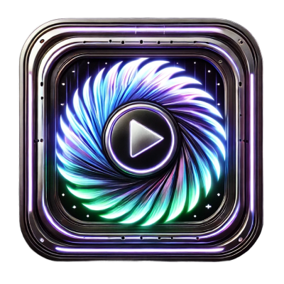

# Aurora Video Synthesizer 🎬✨



## Overview

Aurora Video Synthesizer is a powerful web application that uses advanced AI technology to generate stunning videos from text descriptions. Built with modern web technologies, it offers an intuitive UI for creating, enhancing, and managing AI-generated videos.

## Features

✅ **AI Video Generation**: Transform text prompts into full videos with custom styles and settings  
✅ **Video Enhancement**: Apply filters, speed adjustments, and other enhancements to your videos  
✅ **Batch Processing**: Queue multiple video generation tasks  
✅ **Responsive Design**: Perfect UI experience on any device from mobile to desktop  
✅ **Real-time Status**: Track the progress of your video generation in real-time  
✅ **User Dashboard**: Manage all your generated videos in one place  

## Tech Stack

- **Frontend**: React 18, TypeScript, Vite
- **UI Library**: Tailwind CSS, Shadcn UI components
- **State Management**: TanStack React Query
- **Routing**: React Router v6
- **Animations**: Framer Motion
- **Icons**: Lucide React

## Setup Instructions

### Prerequisites

- Node.js 16+ 
- npm or yarn

### Installation

1. Clone the repository
   ```bash
   git clone https://github.com/yourusername/aurora-video-synthesizer.git
   cd aurora-video-synthesizer
   ```

2. Install dependencies
   ```bash
   npm install
   # or
   yarn
   ```

3. Start the development server
   ```bash
   npm run dev
   # or
   yarn dev
   ```

4. Open `http://localhost:5173` in your browser

## Project Structure

```
aurora-video-synthesizer/
├── public/              # Static assets
├── src/
│   ├── components/      # UI components
│   │   ├── ui/          # Shadcn UI components
│   │   ├── landing/     # Landing page components
│   │   ├── video/       # Video-related components
│   │   └── generate/    # Video generation components
│   ├── hooks/           # Custom React hooks
│   ├── lib/             # Utility functions
│   ├── pages/           # Page components
│   │   ├── auth/        # Authentication pages
│   │   ├── dashboard/   # Dashboard pages
│   │   └── layout/      # Layout components
│   ├── styles/          # Global styles
│   ├── App.tsx          # Main App component
│   └── main.tsx         # Entry point
├── supabase/            # Supabase functions and configuration
├── docs/                # Documentation
├── package.json
└── tailwind.config.ts
```

## Usage Guide

### Generating a Video

1. Navigate to the Dashboard > Generate page
2. Enter a descriptive prompt for your video
3. Configure settings (duration, style, resolution, etc.)
4. Click "Generate Video" and wait for processing
5. Your video will appear in the Dashboard > Videos section when ready

### Enhancing Videos

1. Navigate to Dashboard > Enhance
2. Select a video from your library
3. Choose enhancement options (color grading, stabilization, etc.)
4. Apply changes and wait for processing
5. Download or share your enhanced video

## Deployment

This project can be deployed using any static site hosting service:

- Vercel
- Netlify
- GitHub Pages
- Firebase Hosting

## Development Tasks

Refer to the `docs/tasks.md` file for a detailed breakdown of UI improvement tasks.

## Contributing

1. Fork the repository
2. Create your feature branch (`git checkout -b feature/amazing-feature`)
3. Commit your changes (`git commit -m 'Add some amazing feature'`)
4. Push to the branch (`git push origin feature/amazing-feature`)
5. Open a Pull Request

## License

This project is licensed under the MIT License - see the LICENSE file for details.

## Acknowledgments

- [Shadcn UI](https://ui.shadcn.com/) for providing beautiful UI components
- [Lucide](https://lucide.dev/) for the icon set
- [TanStack Query](https://tanstack.com/query) for data fetching
